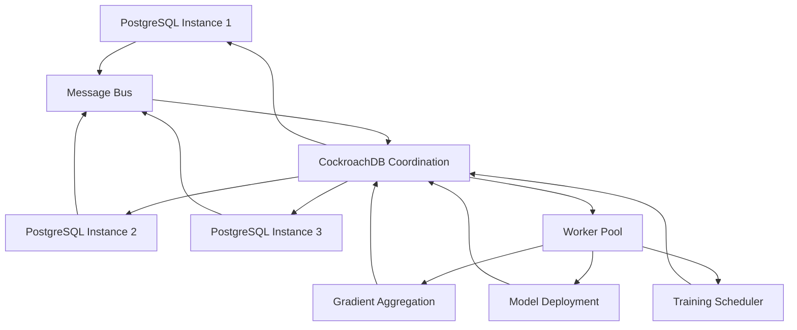

# Two-Tier Coordination Design

**Scalable Machine Learning Through Distributed Database Architecture**

DeclarativeML uses a two-tier distributed architecture that separates blocking/synchronous operations from non-blocking coordination. This design eliminates the distributed systems tax on performance-critical ML operations while maintaining global consistency and coordination.

## Architecture Overview

### Tier 1: PostgreSQL Compute Layer
- **Purpose**: High-performance blocking operations (training, inference, feature computation)
- **Characteristics**: Local state, minimal network communication, optimized for throughput
- **Coordination**: Event-driven through pub/sub messaging
- **Scaling**: Horizontal scaling through instance replication

### Tier 2: CockroachDB Coordination Layer  
- **Purpose**: Global state management, metadata coordination, async orchestration
- **Characteristics**: Distributed consensus, strong consistency, automated failover
- **Operations**: Model checkpoints, training coordination, resource allocation
- **Scaling**: Native distributed scaling with automatic sharding

## Operational Separation

### Blocking Operations (PostgreSQL)

**Training Iterations**
```sql
-- Runs entirely on local PostgreSQL instance
FOR epoch IN 1..max_epochs LOOP
  -- Forward pass using local data and model state
  predictions := forward_pass(model, batch_data);
  
  -- Compute gradients locally
  gradients := compute_gradients(predictions, targets);
  
  -- Update local model parameters
  UPDATE model_weights 
  SET weights = apply_gradients(weights, gradients, learning_rate)
  WHERE model_name = current_model;
  
  -- Only coordinate when epoch complete
  IF epoch % sync_frequency = 0 THEN
    PUBLISH EVENT 'training.epoch_complete' 
      WITH PAYLOAD {
        'instance_id': pg_instance_id,
        'model_name': current_model,
        'epoch': epoch,
        'local_gradients': gradients,
        'loss': current_loss
      };
  END IF;
END LOOP;
```

**Feature Engineering**
```sql
-- Complex transformations stay local
WITH feature_pipeline AS (
  SELECT customer_id,
    -- CPU-intensive feature computations
    calculate_rfm_features(transaction_history) as rfm,
    extract_time_series_features(usage_patterns) as ts_features,
    apply_custom_transformations(raw_features) as custom
  FROM customer_data
  WHERE partition_key = CURRENT_PARTITION
)
-- Store locally for training
INSERT INTO local_feature_cache
SELECT * FROM feature_pipeline;
```

### Non-Blocking Operations (CockroachDB)

**Model Coordination**
```sql
-- Global model state management
CREATE TABLE model_registry (
  model_name STRING PRIMARY KEY,
  current_version INT NOT NULL,
  training_instances STRING[] NOT NULL,
  coordination_state JSONB NOT NULL,
  last_checkpoint TIMESTAMP NOT NULL,
  performance_metrics JSONB,
  INDEX idx_training_status (coordination_state->>'status')
) USING HASH SHARDED BY model_name;

-- Async model assembly from distributed training
CREATE TABLE gradient_aggregation_queue (
  training_id STRING,
  instance_id STRING,
  epoch INT,
  gradients BYTES,
  received_at TIMESTAMP DEFAULT NOW(),
  processed BOOL DEFAULT FALSE,
  PRIMARY KEY (training_id, instance_id, epoch)
);

-- Worker coordination for model assembly
CREATE TABLE training_coordination (
  training_id STRING PRIMARY KEY,
  expected_workers INT NOT NULL,
  current_epoch INT NOT NULL,
  workers_ready STRING[] NOT NULL,
  assembly_status STRING NOT NULL DEFAULT 'waiting',
  global_model_weights BYTES,
  performance_metrics JSONB,
  created_at TIMESTAMP DEFAULT NOW()
);
```

**Resource Allocation**
```sql
-- Dynamic resource management
CREATE TABLE postgres_instances (
  instance_id STRING PRIMARY KEY,
  endpoint STRING NOT NULL,
  capabilities STRING[] NOT NULL,
  current_load FLOAT NOT NULL DEFAULT 0.0,
  max_memory STRING NOT NULL,
  gpu_available BOOL NOT NULL DEFAULT FALSE,
  status STRING NOT NULL DEFAULT 'active',
  last_heartbeat TIMESTAMP DEFAULT NOW(),
  current_models STRING[] NOT NULL DEFAULT ARRAY[]::STRING[]
);

-- Workload assignment queue
CREATE TABLE workload_queue (
  workload_id STRING PRIMARY KEY,
  workload_type STRING NOT NULL, -- 'training', 'inference', 'feature_eng'
  model_name STRING NOT NULL,
  priority INT NOT NULL DEFAULT 5,
  resource_requirements JSONB NOT NULL,
  assigned_instance STRING,
  status STRING NOT NULL DEFAULT 'pending',
  created_at TIMESTAMP DEFAULT NOW(),
  assigned_at TIMESTAMP,
  completed_at TIMESTAMP
);
```

## Event-Driven Coordination

### Message Flow Architecture



### Message Types and Handlers

**Training Coordination Messages**
```sql
-- PostgreSQL publishes training progress
CREATE OR REPLACE FUNCTION publish_training_event(
  event_type TEXT,
  model_name TEXT,
  instance_id TEXT,
  payload JSONB
) RETURNS VOID AS $
BEGIN
  -- Store locally for durability
  INSERT INTO local_event_log (event_type, model_name, payload, created_at)
  VALUES (event_type, model_name, payload, NOW());
  
  -- Send to coordination layer via async queue
  INSERT INTO outbound_message_queue (
    destination, event_type, payload, priority
  ) VALUES (
    'coordination_layer', event_type, 
    payload || jsonb_build_object('instance_id', instance_id),
    CASE event_type 
      WHEN 'training.epoch_complete' THEN 3
      WHEN 'training.converged' THEN 1
      ELSE 5
    END
  );
END;
$ LANGUAGE plpgsql;

-- CockroachDB processes coordination events
CREATE OR REPLACE FUNCTION handle_training_event() RETURNS TRIGGER AS $
DECLARE
  training_state RECORD;
  ready_count INT;
BEGIN
  CASE NEW.event_type
    WHEN 'training.epoch_complete' THEN
      -- Add gradients to aggregation queue
      INSERT INTO gradient_aggregation_queue (
        training_id, instance_id, epoch, gradients
      ) VALUES (
        NEW.payload->>'model_name',
        NEW.payload->>'instance_id', 
        (NEW.payload->>'epoch')::INT,
        decode(NEW.payload->>'gradients', 'base64')
      );
      
      -- Check if all workers ready for this epoch
      SELECT COUNT(*) INTO ready_count
      FROM gradient_aggregation_queue 
      WHERE training_id = NEW.payload->>'model_name'
        AND epoch = (NEW.payload->>'epoch')::INT
        AND processed = FALSE;
      
      SELECT expected_workers INTO training_state
      FROM training_coordination
      WHERE training_id = NEW.payload->>'model_name';
      
      -- Trigger gradient aggregation if all workers ready
      IF ready_count >= training_state.expected_workers THEN
        INSERT INTO workload_queue (
          workload_id, workload_type, model_name, priority
        ) VALUES (
          gen_random_uuid()::STRING,
          'gradient_aggregation',
          NEW.payload->>'model_name',
          1 -- High priority
        );
      END IF;
      
    WHEN 'training.converged' THEN
      -- Update model registry with final weights
      UPDATE model_registry 
      SET current_version = current_version + 1,
          performance_metrics = NEW.payload->'final_metrics',
          last_checkpoint = NOW()
      WHERE model_name = NEW.payload->>'model_name';
      
      -- Trigger deployment workflow
      INSERT INTO workload_queue (
        workload_id, workload_type, model_name, priority
      ) VALUES (
        gen_random_uuid()::STRING,
        'model_deployment',
        NEW.payload->>'model_name',
        2
      );
  END CASE;
  
  RETURN NEW;
END;
$ LANGUAGE plpgsql;

CREATE TRIGGER training_event_handler
  AFTER INSERT ON coordination_events
  FOR EACH ROW EXECUTE FUNCTION handle_training_event();
```

## Worker Pool Architecture

### Gradient Aggregation Workers

```sql
-- Worker function for gradient aggregation
CREATE OR REPLACE FUNCTION gradient_aggregation_worker(
  workload_id STRING
) RETURNS BOOL AS $
DECLARE
  model_name STRING;
  current_epoch INT;
  gradient_data RECORD;
  aggregated_gradients BYTES;
  worker_count INT;
BEGIN
  -- Get workload details
  SELECT w.model_name INTO model_name
  FROM workload_queue w
  WHERE w.workload_id = gradient_aggregation_worker.workload_id;
  
  -- Get current epoch from coordination state
  SELECT current_epoch INTO current_epoch
  FROM training_coordination 
  WHERE training_id = model_name;
  
  -- Collect all gradients for this epoch
  FOR gradient_data IN 
    SELECT instance_id, gradients 
    FROM gradient_aggregation_queue
    WHERE training_id = model_name 
      AND epoch = current_epoch
      AND processed = FALSE
  LOOP
    -- Aggregate gradients (implemented in extension)
    aggregated_gradients := aggregate_gradient_bytes(
      aggregated_gradients, 
      gradient_data.gradients
    );
    worker_count := worker_count + 1;
  END LOOP;
  
  -- Average the gradients
  aggregated_gradients := scale_gradient_bytes(
    aggregated_gradients, 
    1.0 / worker_count
  );
  
  -- Store aggregated result
  UPDATE training_coordination
  SET global_model_weights = aggregated_gradients,
      assembly_status = 'ready_for_broadcast'
  WHERE training_id = model_name;
  
  -- Mark gradients as processed
  UPDATE gradient_aggregation_queue
  SET processed = TRUE
  WHERE training_id = model_name AND epoch = current_epoch;
  
  -- Broadcast updated weights to all PostgreSQL instances
  INSERT INTO broadcast_queue (
    target_instances, message_type, payload
  ) 
  SELECT 
    training_instances,
    'weight_update',
    jsonb_build_object(
      'model_name', model_name,
      'epoch', current_epoch,
      'weights', encode(aggregated_gradients, 'base64')
    )
  FROM training_coordination
  WHERE training_id = model_name;
  
  RETURN TRUE;
END;
$ LANGUAGE plpgsql;
```

### Model Deployment Workers

```sql
-- Automated model deployment workflow
CREATE OR REPLACE FUNCTION model_deployment_worker(
  workload_id STRING  
) RETURNS BOOL AS $
DECLARE
  model_info RECORD;
  deployment_config JSONB;
  target_instances STRING[];
BEGIN
  -- Get model details
  SELECT mr.model_name, mr.current_version, mr.performance_metrics
  INTO model_info
  FROM workload_queue wq
  JOIN model_registry mr ON wq.model_name = mr.model_name
  WHERE wq.workload_id = model_deployment_worker.workload_id;
  
  -- Get deployment configuration
  SELECT deployment_settings INTO deployment_config
  FROM model_deployment_config
  WHERE model_name = model_info.model_name;
  
  -- Validate model performance before deployment
  IF (model_info.performance_metrics->>'accuracy')::FLOAT < 
     (deployment_config->>'min_accuracy')::FLOAT THEN
    -- Mark deployment as failed
    UPDATE workload_queue
    SET status = 'failed',
        completed_at = NOW()
    WHERE workload_id = model_deployment_worker.workload_id;
    
    RETURN FALSE;
  END IF;
  
  -- Select target instances for deployment
  SELECT ARRAY_AGG(instance_id) INTO target_instances
  FROM postgres_instances
  WHERE 'inference' = ANY(capabilities)
    AND status = 'active'
    AND current_load < (deployment_config->>'max_load_threshold')::FLOAT
  ORDER BY current_load
  LIMIT (deployment_config->>'target_instance_count')::INT;
  
  -- Deploy to selected instances
  INSERT INTO deployment_queue (
    model_name, model_version, target_instances, deployment_config
  ) VALUES (
    model_info.model_name,
    model_info.current_version,
    target_instances,
    deployment_config
  );
  
  -- Create monitoring agents for deployed model
  INSERT INTO agent_spawn_queue (
    agent_type, model_name, configuration
  ) VALUES (
    'drift_monitor',
    model_info.model_name,
    jsonb_build_object(
      'check_frequency', '1 hour',
      'drift_threshold', 0.2,
      'target_instances', target_instances
    )
  );
  
  RETURN TRUE;
END;
$ LANGUAGE plpgsql;
```

## Data Locality and Partitioning

### Intelligent Data Placement

```sql
-- Data locality optimization
CREATE TABLE data_locality_hints (
  table_name STRING,
  partition_key STRING,
  preferred_instances JSONB, -- Map partition values to instances
  access_patterns JSONB,     -- Historical access frequency
  updated_at TIMESTAMP DEFAULT NOW()
);

-- Function to route queries based on data locality
CREATE OR REPLACE FUNCTION route_training_query(
  model_name STRING,
  training_query STRING
) RETURNS STRING[] AS $
DECLARE
  source_tables STRING[];
  optimal_instances STRING[];
  locality_info RECORD;
BEGIN
  -- Extract source tables from query
  source_tables := extract_tables_from_query(training_query);
  
  -- For each source table, find optimal instances
  FOR locality_info IN
    SELECT table_name, preferred_instances
    FROM data_locality_hints
    WHERE table_name = ANY(source_tables)
  LOOP
    -- Intersect with available instances
    optimal_instances := array_intersect(
      optimal_instances,
      get_available_instances_for_table(locality_info.table_name)
    );
  END LOOP;
  
  -- Fallback to load-based assignment if no locality info
  IF array_length(optimal_instances, 1) IS NULL THEN
    SELECT ARRAY_AGG(instance_id) INTO optimal_instances
    FROM postgres_instances
    WHERE status = 'active'
    ORDER BY current_load
    LIMIT get_training_parallelism(model_name);
  END IF;
  
  RETURN optimal_instances;
END;
$ LANGUAGE plpgsql;
```

### Cache Coordination

```sql
-- Shared cache management across instances
CREATE TABLE shared_cache_registry (
  cache_key STRING PRIMARY KEY,
  content_hash STRING NOT NULL,
  size_bytes BIGINT NOT NULL,
  cached_instances STRING[] NOT NULL,
  access_count BIGINT DEFAULT 0,
  last_accessed TIMESTAMP DEFAULT NOW(),
  expiry_time TIMESTAMP
);

-- Cache invalidation coordination
CREATE OR REPLACE FUNCTION invalidate_shared_cache(
  cache_pattern STRING
) RETURNS VOID AS $
BEGIN
  -- Mark cache entries for invalidation
  UPDATE shared_cache_registry
  SET expiry_time = NOW()
  WHERE cache_key LIKE cache_pattern;
  
  -- Send invalidation messages to all instances
  INSERT INTO broadcast_queue (
    target_instances, message_type, payload
  )
  SELECT 
    ARRAY_AGG(DISTINCT instance_id),
    'cache_invalidation',
    jsonb_build_object('pattern', cache_pattern)
  FROM postgres_instances
  WHERE status = 'active';
END;
$ LANGUAGE plpgsql;
```

## Fault Tolerance and Recovery

### Instance Failure Handling

```sql
-- Heartbeat monitoring and failure detection
CREATE OR REPLACE FUNCTION monitor_instance_health() RETURNS VOID AS $
DECLARE
  failed_instance RECORD;
  affected_models STRING[];
BEGIN
  -- Detect failed instances (no heartbeat in 2 minutes)
  FOR failed_instance IN
    SELECT instance_id, current_models
    FROM postgres_instances
    WHERE last_heartbeat < NOW() - INTERVAL '2 minutes'
      AND status = 'active'
  LOOP
    -- Mark instance as failed
    UPDATE postgres_instances
    SET status = 'failed'
    WHERE instance_id = failed_instance.instance_id;
    
    -- Get affected models
    affected_models := failed_instance.current_models;
    
    -- Reassign training workloads
    FOR model_name IN SELECT unnest(affected_models) LOOP
      -- Find replacement instances
      INSERT INTO workload_queue (
        workload_id, workload_type, model_name, priority,
        resource_requirements
      )
      SELECT 
        gen_random_uuid()::STRING,
        'training_migration',
        model_name,
        1, -- High priority
        jsonb_build_object(
          'failed_instance', failed_instance.instance_id,
          'model_name', model_name
        )
      FROM training_coordination
      WHERE training_id = model_name;
    END LOOP;
    
    -- Notify administrators
    INSERT INTO alert_queue (
      alert_type, severity, message
    ) VALUES (
      'instance_failure',
      'critical',
      'PostgreSQL instance ' || failed_instance.instance_id || ' has failed'
    );
  END LOOP;
END;
$ LANGUAGE plpgsql;

-- Automatic training migration
CREATE OR REPLACE FUNCTION migrate_training_workload(
  workload_id STRING
) RETURNS BOOL AS $
DECLARE
  migration_info RECORD;
  replacement_instance STRING;
  model_checkpoint BYTES;
BEGIN
  -- Get migration details
  SELECT 
    w.resource_requirements->>'failed_instance' AS failed_instance,
    w.model_name,
    tc.global_model_weights
  INTO migration_info
  FROM workload_queue w
  JOIN training_coordination tc ON w.model_name = tc.training_id
  WHERE w.workload_id = migrate_training_workload.workload_id;
  
  -- Find suitable replacement instance
  SELECT instance_id INTO replacement_instance
  FROM postgres_instances
  WHERE status = 'active'
    AND 'training' = ANY(capabilities)
    AND instance_id != migration_info.failed_instance
  ORDER BY current_load
  LIMIT 1;
  
  -- Transfer model state to replacement instance
  INSERT INTO model_transfer_queue (
    target_instance, model_name, model_weights, transfer_type
  ) VALUES (
    replacement_instance,
    migration_info.model_name,
    migration_info.global_model_weights,
    'failure_recovery'
  );
  
  -- Update training coordination
  UPDATE training_coordination
  SET training_instances = array_replace(
    training_instances,
    migration_info.failed_instance,
    replacement_instance
  )
  WHERE training_id = migration_info.model_name;
  
  RETURN TRUE;
END;
$ LANGUAGE plpgsql;
```

## Performance Monitoring

### Cross-Tier Metrics Collection

```sql
-- Performance metrics aggregation
CREATE TABLE performance_metrics (
  metric_id STRING PRIMARY KEY,
  instance_id STRING NOT NULL,
  metric_type STRING NOT NULL, -- 'training_throughput', 'query_latency', etc.
  metric_value FLOAT NOT NULL,
  metadata JSONB,
  recorded_at TIMESTAMP DEFAULT NOW(),
  INDEX idx_instance_type_time (instance_id, metric_type, recorded_at)
);

-- Real-time performance dashboard data
CREATE MATERIALIZED VIEW cluster_performance_summary AS
SELECT 
  instance_id,
  AVG(CASE WHEN metric_type = 'training_throughput' THEN metric_value END) as avg_training_throughput,
  AVG(CASE WHEN metric_type = 'query_latency' THEN metric_value END) as avg_query_latency,
  AVG(CASE WHEN metric_type = 'memory_usage' THEN metric_value END) as avg_memory_usage,
  COUNT(CASE WHEN metric_type = 'error' THEN 1 END) as error_count,
  MAX(recorded_at) as last_update
FROM performance_metrics
WHERE recorded_at > NOW() - INTERVAL '1 hour'
GROUP BY instance_id;

-- Refresh performance summary every minute
CREATE OR REPLACE FUNCTION refresh_performance_summary() RETURNS VOID AS $
BEGIN
  REFRESH MATERIALIZED VIEW cluster_performance_summary;
END;
$ LANGUAGE plpgsql;
```

## Scaling Strategies

### Dynamic Scaling Based on Workload

```sql
-- Auto-scaling logic based on queue depth and performance
CREATE OR REPLACE FUNCTION evaluate_scaling_needs() RETURNS VOID AS $
DECLARE
  queue_depth INT;
  avg_completion_time INTERVAL;
  target_instances INT;
  current_instances INT;
BEGIN
  -- Analyze current workload
  SELECT COUNT(*), AVG(completed_at - created_at)
  INTO queue_depth, avg_completion_time
  FROM workload_queue
  WHERE status IN ('pending', 'running')
    AND created_at > NOW() - INTERVAL '10 minutes';
  
  -- Calculate target instance count
  target_instances := CASE
    WHEN queue_depth > 50 AND avg_completion_time > INTERVAL '5 minutes' THEN
      LEAST(current_instances * 2, 20) -- Scale up, max 20 instances
    WHEN queue_depth < 10 AND avg_completion_time < INTERVAL '1 minute' THEN
      GREATEST(current_instances / 2, 3) -- Scale down, min 3 instances  
    ELSE current_instances -- No scaling needed
  END;
  
  SELECT COUNT(*) INTO current_instances
  FROM postgres_instances 
  WHERE status = 'active';
  
  -- Trigger scaling if needed
  IF target_instances != current_instances THEN
    INSERT INTO scaling_requests (
      current_count, target_count, reason, created_at
    ) VALUES (
      current_instances,
      target_instances, 
      'workload_based_scaling',
      NOW()
    );
  END IF;
END;
$ LANGUAGE plpgsql;
```

---

*The two-tier architecture enables massive scale by keeping performance-critical operations local while coordinating complex workflows through a robust distributed system.*